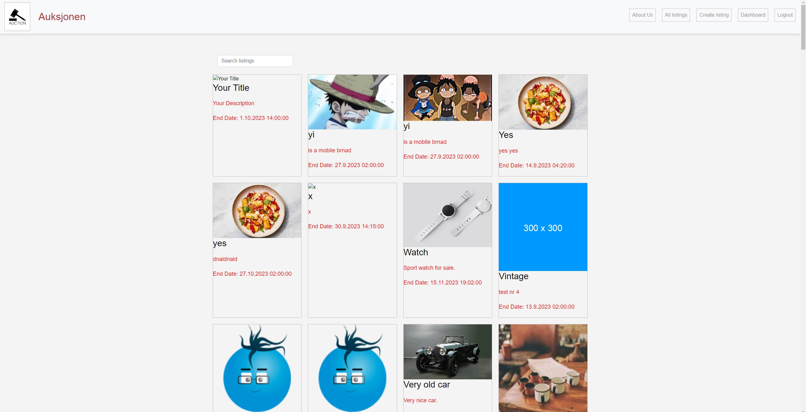

# Auksjonen


## Description

#### This website was made for my school Semester Project 2

The brief: An auction site is looking to launch a website where users can add items to be bid on and bid on items other users have put up for auction.

When a new user joins the website, they are given 1000 credits to use on the site. They can get credits by selling items and use credit by buying items. Non-registered users can search through the listings, but only registered users can make bids on listings.

## Built With

- CSS
- HTML
- JavaScript
- Bootstrap

## Getting Started
### Installing

1. Clone the repo:
```bash
-  git clone https://github.com/Youngjooham/semester-project-2-Young-Joo-Ham.git
```
2. Install the dependencies:
```bash   
   npm install
```

## Running
To run the app, run the following commands:
npm run start
use the live server

## Contributing
Young Joo Ham

## Contact

[My LinkedIn page](https://www.linkedin.com/in/youngjoo-ham-23b23395/?originalSubdomain=no)
